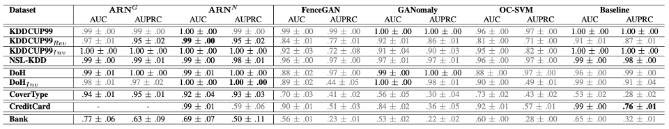

# Adversarial Regularized Reconstruction for Anomaly Detection and Generation

This is the accompanying code for the paper

**Adversarial Regularized Reconstruction for Anomaly Detection and Generation**.

The repository contains all code to re-execute our models and competitors presented in the paper. You need Pytorch >= 1.5 to run it. 

The repository contains the following folders:

- **env**, with the library requirements to create the python environment;
- **ARN_G**, the code to run the $ARN^G$ model for each dataset;
- **ARN_G_KLD**, the code to run the $ARN^{G-KLD}$ model for each dataset;
- **ARN_GE**, the code to run the $ARN^{GE}$ model for each dataset;
- **ARN_N**, the code to run the $ARN^N$ model for each dataset;
- **ARN_N_KLD**, the code to run the $ARN^{N-KLD}$ model for each dataset;
- **ARN_mnist**, the code for experimets on MNIST dataset;
- **Contamination**, the code to run experiments with dataset contamination for each dataset;
- **Weak_Supervision**, the code to run the models with weak supervision approach for each dataset;
- **GENERATION_KDDCUP99REV**, the code used to create Real and generated anomalies in $KDDCUP99_{Rev}$;
- **Competitors**, the code to execute experiments for competitors.

Each folder contains the code in jupyter notebooks. The first cell contains the import statement with the libraries used in the notebook and the environment variable to activate the GPU device. The last cell contains the code to print the results.

The pre-trained models produced by ARN notebooks area available to [link](https://www.dropbox.com/sh/ll79r0x378j5me9/AABHU-znW3v06urtTdwcgkJka?dl=0)

The following table shows the results presented in the paper.

## Dataset Reference

- [KDDCUP99](http://kdd.ics.uci.edu/databases/kddcup99/kddcup99.html)
- [NSL-KDD](https://www.unb.ca/cic/datasets/nsl.html) 
- [DoH](https://www.unb.ca/cic/datasets/dohbrw-2020.html)
- [CoverType](https://archive.ics.uci.edu/ml/datasets/covertype)
- [CreditCard](http://www.ulb.ac.be/di/map/adalpozz/data/creditcard.Rdata)
- [Bank](https://github.com/GuansongPang/anomaly-detection-datasets)
- [MNIST](http://yann.lecun.com/exdb/mnist)

All datasets must be in a folder named *Dataset*
